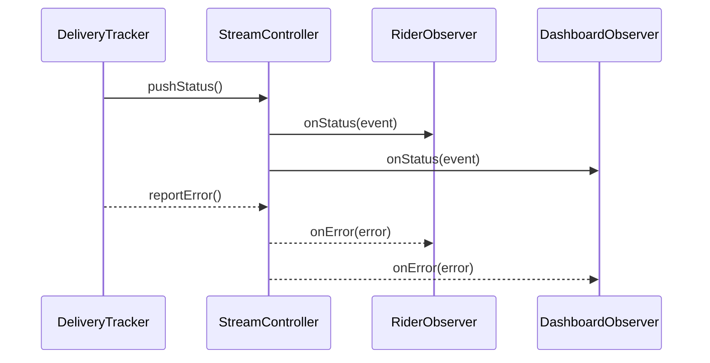

# Observer 패턴 (옵저버 패턴)

## 한 줄 정의
상태가 바뀔 때마다 관찰자에게 비동기 이벤트를 푸시해 느슨하게 결합된 반응형 협력을 만든다.

## 10줄 요약
1. 주제(subject)는 이벤트를 방출하고, 옵저버는 이를 구독하는 다대다 관계를 형성한다.
2. Dart에서는 `StreamController.broadcast`로 동시 구독과 이벤트 순서를 쉽게 보장한다.
3. 구독 해제(dispose)는 필수이며, 메모리 누수와 중복 알림을 방지한다.
4. 옵저버는 `onStatus`, `onError`, `onDone`을 구현해 정상 흐름과 예외 모두를 다룬다.
5. 강결합을 피하려면 옵저버가 주제를 직접 호출하지 말고 이벤트 데이터만으로 판단하게 설계한다.
6. Riverpod과 결합하면 `StreamProvider`나 `AutoDisposeNotifierProvider`로 UI 갱신을 안정적으로 관리한다.
7. 긴 수명 스트림에서 백프레셔가 필요하면 `StreamTransformer`나 배치 처리로 완화한다.
8. 테스트에서는 지연 전파와 에러 전파를 명시적으로 검증해 히든 버그를 예방한다.
9. UI에서는 토스트·스낵바 등 단발성 피드백과 리스트 업데이트를 분리해 UX 혼잡을 줄인다.
10. 옵저버 수가 많아질수록 이벤트 필터링과 스로틀링 전략을 설계 단계에서 함께 논의해야 한다.

## 이벤트 흐름 다이어그램

## 핵심 개념
- **주제(Subject)**: `DeliveryTracker`처럼 구독자를 관리하고 이벤트를 브로드캐스트하는 발신자.
- **옵저버(Observer)**: `DeliveryObserver` 인터페이스를 통해 특정 이벤트 타입에 반응하는 구독자.
- **이벤트 모델**: `DeliveryEvent` 데이터 클래스로 상태 변화와 메타 정보를 함께 전달한다.
- **비동기 브로드캐스트**: `StreamController.broadcast`가 멀티 구독자 시나리오를 단순화한다.

## 구현 절차
1. 이벤트 모델(`DeliveryEvent`)과 상태 열거형(`DeliveryStatus`)을 정의한다.
2. 옵저버 인터페이스에 상태·에러 핸들러를 모두 선언해 일관된 계약을 제공한다.
3. 주제(`DeliveryTracker`)는 구독자 목록과 `StreamSubscription`을 관리하며, 이벤트 입력 시 `add`/`addError`를 호출한다.
4. 구독 해제는 `Future<void> Function()` 디스포저로 래핑해 호출 시 안전하게 취소한다.
5. Riverpod에서는 `AutoDisposeNotifierProvider`로 스트림을 UI 상태로 축약하고, `ref.onDispose`로 구독을 정리한다.

## Dart 콘솔 예제
- `lib/src/observer/observer_example.dart`의 `main()`은 `DeliveryTracker`에 콘솔 옵저버를 붙여 주문 상태 변화를 출력한다.
- 10ms 딜레이 후 세 단계 상태 업데이트를 통해 이벤트 순서 유지와 해제 후 정리를 보여준다.

## Riverpod 연동 예시
- `deliveryTrackerProvider`는 `Provider`로 트래커를 생성하고, `ref.onDispose`로 리소스를 회수한다.
- `deliveryTimelineProvider`는 `AutoDisposeNotifierProvider`를 사용해 이벤트와 에러를 누적한 `DeliveryTimeline`을 노출한다.
- `deliveryStreamProvider`를 `ConsumerWidget`에서 구독하면 SnackBar, 로딩 인디케이터 등을 쉽게 연결할 수 있다.

## 대안 및 비교 (5선)
- `ChangeNotifier`: 간단하지만 옵저버 수가 늘면 전체 리스너가 리빌드돼 세밀한 제어가 어렵다.
- `InheritedWidget`: 위젯 트리에 특화되어 있지만 비동기 이벤트 스트림에는 부적합하다.
- `EventBus`: 전역 이벤트 루프를 빠르게 구축할 수 있지만 타입 안정성과 구독 해제 관리가 약하다.
- `Bloc`: 상태 흐름을 명확히 하지만 코드 생성과 보일러플레이트가 늘어난다.
- `RxDart`: 고급 연산자를 제공하나 학습 곡선과 종속성이 커진다.

## 안티패턴·주의점
- 옵저버 등록 시 이미 등록된 객체를 재사용하면 이벤트가 중복 전달될 수 있다.
- `StreamController`를 `sync: false`로 두고 긴 작업을 수행하면 이벤트 순서가 꼬일 수 있으니 동기 브로드캐스트(`sync: true`)를 고려한다.
- UI에서 직접 `StreamSubscription`을 관리하면 생명주기 누수 위험이 커지므로 프로바이더에서 래핑한다.

## 예상 Q&A
1. 옵저버가 많은데 순서를 보장하려면?  
2. 에러 이벤트만 별도 로깅하려면?  
3. 스트림을 재시작해야 할 때는?  
4. Flutter 위젯 테스트에서 스트림을 어떻게 주입하나?  
5. 백오프/재시도 로직은 어디에 두나?  
> 상세 답변은 `observer_qna.md`에서 확인할 수 있다.

## 과제와 힌트
1. **지연 배송 이벤트에 알람 스로틀링 추가**: `StreamTransformer.debounce`로 특정 시간 이후에만 알림을 발송하라.
2. **에러 기반 재연결 로직 구성**: `reportError` 발생 시 재시도 스케줄러(`Timer`)를 두고 성공하면 취소한다.
3. **구독자별 필터링 구현**: 옵저버 등록 시 관심 주문 ID 리스트를 전달받고, `listen` 직전에 `where` 필터를 적용하라.
> 모범 답안은 `observer_assignments.md`에서 제공된다.
